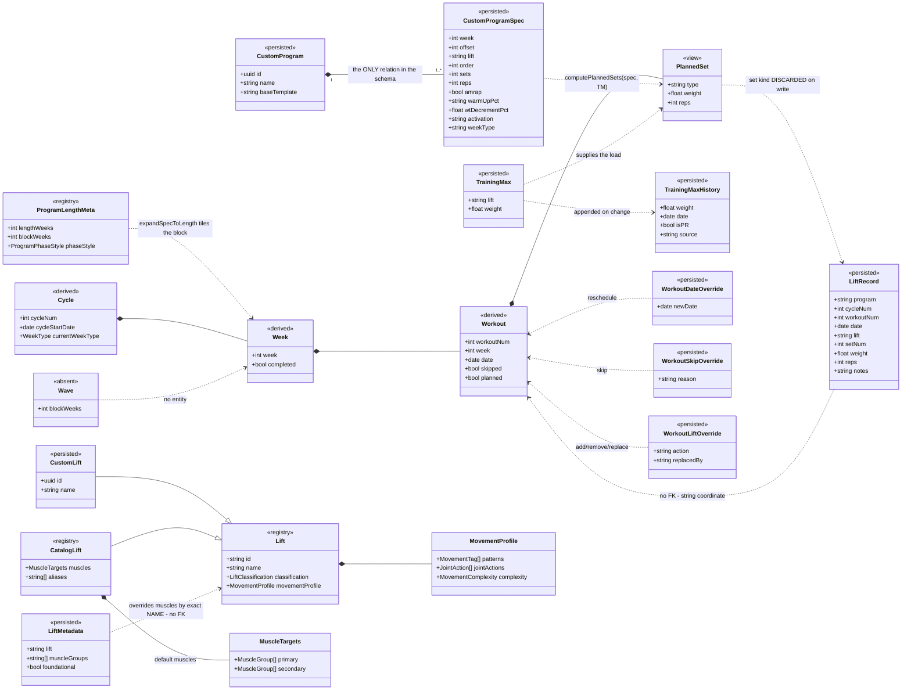

# Training Domain Model

**Status:** Active — descriptive. This documents the model **as built**, not a target state.
**Verified against:** `main` @ 2026-09-22. Counts and citations below were checked at that
point; re-verify before relying on one in an argument. CI-enforcing the mechanically
derivable ones is tracked in
[#1012](https://github.com/merickvaughn/lifting-logbook/issues/1012).

> **The one thing to know.** The ladder is
> `Program → Cycle → Week → Workout → Lift slot → Set`, and **only the leaf is a row.**
> `LiftRecord` carries the whole `(program, cycleNum, workoutNum, date, lift, setNum)`
> coordinate; every level above it is recomputed per request from the program spec plus a
> handful of override rows. Section 1 explains why; if you only need the model, start at
> section 3.

## Contents

1. [Why the model is shaped this way](#1-why-the-model-is-shaped-this-way)
2. [The lift taxonomy](#2-the-lift-taxonomy)
3. [The training-structure taxonomy](#3-the-training-structure-taxonomy)
4. [Prescribed vs. logged](#4-prescribed-vs-logged)
5. [Class diagram](#5-class-diagram)
6. [Known divergences](#6-known-divergences)

This repo has no single file you can read to learn what a workout *is*. The answer is
spread across `packages/types/src/domain.ts` (the lift taxonomy),
`packages/types/src/api.ts` (the structural hierarchy, as transport DTOs),
[`packages/core/src/presets/programLengths.ts`](../packages/core/src/presets/programLengths.ts)
(program length and periodization), [`apps/web/lib/workoutPlan.ts`](../apps/web/lib/workoutPlan.ts)
(the week/workout/set view models), and
[`apps/api/prisma/schema.prisma`](../apps/api/prisma/schema.prisma) (what is actually
stored). This document states the model in one place and — more importantly — marks
which parts of it are **rows** and which are **recomputed on every request**.

There are two taxonomies here, modeled in opposite ways.

---

## 1. Why the model is shaped this way

`packages/core` began as the domain layer of a Google Apps Script logbook that read
and wrote workout grids in Google Sheets. The grid builders and sheet mappers were
archived on 2026-09-04 ([#979](https://github.com/merickvaughn/lifting-logbook/issues/979),
see [`archive/`](../archive)), but the shape they implied survived — and
[`packages/core/src/constants/schema.ts`](../packages/core/src/constants/schema.ts)
still holds the original column headers verbatim:

| Sheet | Columns |
|---|---|
| `LiftRecord` | `Program`, `Cycle #`, `Workout #`, `Date`, `Lift`, `Set #`, `Weight`, `Reps`, `Notes` |
| `TrainingMax` | `Date Updated`, `Lift`, `Weight` |
| `LiftingProgramSpec` | `Week`, `Offset`, `Lift`, `Increment`, `Order`, `Sets`, `Reps`, `AMRAP?`, `Warm-Up %`, `WT Decrement %`, `Activation`, `Week Type` |

That is the whole model: **one prescription table and one log table, joined by integer
coordinates.** Reading the rest of this document with that in mind explains most of
what would otherwise look like an omission — the structural levels are spreadsheet
*columns*, so they never became objects.

---

## 2. The lift taxonomy

This half is modeled deliberately and well. `packages/types/src/domain.ts` defines
**four orthogonal axes**, and the source comments state the orthogonality explicitly:

| Axis | Type | Values | Describes |
|---|---|---|---|
| Role | `LiftClassification` | `compound` \| `accessory` | Its job in the program |
| Pattern | `MovementProfile.patterns: MovementTag[]` | `push`, `pull`, `vertical`, `horizontal`, `hinge`, `carry`, `squat` | Kinesiological pattern |
| Joint action | `MovementProfile.jointActions: JointAction[]` | `flexion`, `extension`, `internal-rotation`, `external-rotation`, `abduction`, `adduction` | What the joints do |
| Complexity | `MovementProfile.complexity` | `simple` \| `compound` | Single- vs multi-joint mechanics |

Pattern tags **combine** rather than enumerate: `push + vertical` is the overhead-press
pattern, `pull + horizontal` is the row pattern. **Vertical and horizontal are measured relative
to the torso**, not the floor ([ADR-036](adr/ADR-036-muscle-group-defaults-and-fractional-set-counts.md)).
So a bench press is a horizontal push even though the lifter lies down, and a dip is a vertical
push because the hands drive down along the torso. An upright row is a vertical pull. Incline
pressing stays horizontal: at 45° or less it presses at least as close to perpendicular to the
torso as to parallel, and what it mainly changes is chest emphasis.

Role and complexity are the pair most easily confused, and `domain.ts` calls this out
directly: a **Goblet Squat is movement-`compound`** (knees and hips) **yet
role-`accessory`**. The two axes are independent and must stay that way.

[`packages/core/src/catalog/lifts.ts`](../packages/core/src/catalog/lifts.ts) carries all
four axes for **23 of the 26 built-in lifts**, grouped by pattern with a trailing accessories
group. Three leave one axis deliberately empty:
- `farmers-carry` has no `jointActions`. A loaded carry has no prime mover driven through a range
  of motion, and the source comment says so explicitly.
- `calf-raise` and `lateral-raise` have no `patterns`. A raise neither pushes nor pulls.

The curls (`cable-curl`, `leg-curl`) keep a lone `pull` tag, since they flex a joint toward the
body, but no direction. So neither a raise nor a curl earns a push/pull direction row.

`isBodyweightComponent` marks the three where body weight contributes to the load (dip, chin-up,
pull-up).

### A fifth axis: muscle groups, defaulted in the catalog, overridden per user

Every catalog entry is a `CatalogLift`: a `Lift` plus `muscles: MuscleTargets`. That field holds
**default** `primary` and `secondary` muscle groups from the 17-name `MUSCLE_GROUPS` vocabulary in
`packages/types`. Weekly set counts credit 1 per primary and ½ per secondary
([ADR-036](adr/ADR-036-muscle-group-defaults-and-fractional-set-counts.md)). The shared `Lift` type
does not carry muscles: a custom lift under its own name has no defaults, and the API never
returns catalog muscles.

Per-user overrides still live in `LiftMetadata` (`muscleGroups`, `substitutions`, `foundational`).
That is a **separate per-user table keyed by lift *name***, while `CustomLift` is keyed by uuid.
- An override on an exact lift name replaces the defaults for that name. Overrides do not follow
  aliases: one on "Squat" leaves "Back Squat" on its defaults.
- An empty list means "use the defaults".
- `muscleGroups` is still an unconstrained `String[]`. Readers canonicalize it
  case-insensitively against the vocabulary and keep unknown text as its own row
  (`buildMuscleTargetResolver`, `packages/core/src/catalog/muscles.ts`).
- Per-user lift attributes still live in two unrelated stores under two different keys. That is why
  a custom-lift rename orphans its overrides (D3).

### Two name registries, one bridge

| Registry | Count | Purpose |
|---|---|---|
| `LIFT_NAMES` (`domain.ts`) | 12 | Autocomplete / onboarding fallback |
| `LIFT_CATALOG` (`core/catalog/lifts.ts`) | 26 | The real catalog: the four axes plus default muscles |
| `CatalogLift.aliases` (per entry) | 4 | Preset names that are neither catalog nor slot names (`Weighted Pull-ups`, `Incline DB Press`, `Calf Raises`, `Lateral Raises`) |

They share 7 names exactly and diverge on 5 — `Squat`/`Back Squat`, `Dips`/`Dip`,
`Face Pulls`/`Face Pull`, `Cable Curls`/`Cable Curl`, `Cable Lat Raise`/`Lateral Raise`.
`DEFAULT_SLOT_MAP` (32 alias keys, [`core/catalog/slotMaps.ts`](../packages/core/src/catalog/slotMaps.ts))
is the reconciliation layer and resolves all of them for import. The onboarding
fallback in `apps/web/app/(authed)/onboarding/page.tsx` renders raw `LIFT_NAMES`
strings **without** passing through that bridge.

`builtInLiftFor(name)` (`core/catalog/builtInLift.ts`) is the one lookup that accepts every form a
built-in goes by:
- catalog display name;
- catalog id;
- per-entry alias;
- slot name.

Lift classification, default muscles and movement patterns all resolve through it. The per-entry
aliases are deliberately **not** in `DEFAULT_SLOT_MAP`. That map also drives the logger's
bodyweight detection, import validation and the custom-lift collision guard, and aliasing
`Weighted Pull-ups` there would flip it to a bodyweight-component lift. Those are separate
decisions, tracked in [#1015](https://github.com/merickvaughn/lifting-logbook/issues/1015).

Every schema column references a lift by **name string**, not by `Lift.id` — see divergence
D3. But the column is not single-vocabulary: the import path can persist a canonical
catalog or custom-lift **id** into that same column when a row is pre-resolved through
`liftOverrides`, which is why `DEFAULT_SLOT_MAP` self-maps canonical ids and why
[`catalog/builtInLift.ts`](../packages/core/src/catalog/builtInLift.ts) opens by stating that
four forms reach its lookup — slot names, catalog names, catalog ids and per-entry aliases.
Import can also store a custom lift's **uuid**, which is why `lookupLift` matches custom lifts
by name *or* id. Code reading a `lift` value must tolerate all of these.

When a name belongs to both a built-in and one of the user's custom lifts, `lookupLift` settles
it. A **reserved** name (a `DEFAULT_SLOT_MAP` slot name, which the custom-lift guard refuses)
always means the built-in. Any other name prefers the custom lift, whose classification and
patterns the user recorded. Default muscles are the one exception: they attach to the *name*, so
a same-named custom lift reads them until it is overridden.

---

## 3. The training-structure taxonomy

The conceptual ladder is:

```
Program → Cycle → Week → Workout → Lift slot → Set
```

Only the leaf is a row. `LiftRecord` carries the **entire coordinate** on every logged
set, and each level above it is reassembled per request.

| Level | Represented as | Stored? |
|---|---|---|
| **Program** | `string` id, plus `ProgramLengthMeta {lengthWeeks, blockWeeks, phaseStyle}` | Registry for built-ins; `custom_program` row for user programs |
| **Block / Wave** | `blockWeeks` arithmetic + `phaseStyle: 'repeating' \| 'wave'` | **No entity.** A wave boundary is `ceil(week / blockWeeks)` |
| **Cycle** | `cycleNum: number`, denormalized onto five child tables | `cycle_dashboard` is `@@unique([userId, program])` — **one row, the current cycle only** |
| **Week** | `week: number` + `WeekType` | **Derived** by tiling (`expandSpecToLength`) |
| **Workout** | `(program, cycleNum, workoutNum)`; `workoutNum` is a **global ordinal** over the cycle, from `orderedWorkoutKeys` | **Derived.** Typed exactly once, as `TimerWorkoutKey` |
| **Lift slot** | spec row keyed `(week, offset, lift, order)` | `custom_program_spec` row |
| **Set** | `PlannedSet` (prescribed) / `LiftRecord` (logged) | One `lift_record` row per completed set |

`offset` is the day-within-week slot; `order` is the position within that day.

### Programs are one block, tiled

A stored spec holds **one repeating block**, expanded to the full program length at read
time — never in storage, so reverting is a pure code change.

| Program | Length | Block | Style |
|---|---|---|---|
| `leangains` | 12 wk | 1 wk | `repeating` (autoregulated, AMRAP-driven) |
| `rpt` | 8 wk | 1 wk | `repeating` |
| `5-3-1` | 12 wk | 3 wk | `wave` (4 waves) |

`programLengths.ts` owns the canonical mapping and the helpers that keep the web grid
and the API in lockstep: `expandSpecToLength`, `blockWeekForProgramWeek`,
`orderedWorkoutKeys` (the `workoutNum ↔ (week, offset)` mapping), and
`noScheduleWorkoutDateUTC`.

> **Three registries must agree:** `PRESET_BASE_SPECS`, `PROGRAM_LENGTHS`, and
> `apps/api`'s `PROGRAM_DEFAULTS`. `programLengths.test.ts` holds the reciprocal guard.

### Overrides stand in for the missing Workout row

Because no workout row exists, an instance diverges from its template through
side-tables keyed `(userId, program, cycleNum, workoutNum)`:

| Table | Purpose |
|---|---|
| `workout_date_override` | Rescheduled to a new date |
| `workout_skip_override` | Explicitly skipped |
| `workout_lift_override` | `action: add \| remove \| replace` (+ `replacedBy`) |
| `cycle_scheduled_workout` | The generated schedule (no HTTP route at all) |

This is the clearest structural evidence of the absent entity: three tables exist to
describe changes to a thing that is not itself stored.

---

## 4. Prescribed vs. logged

The seam between plan and actual is crossed by **four set-shaped types**, and the
layering is deliberate — the dependency arrow points inward, so the web and timer
layers map into their own shapes rather than `packages/core` reaching outward:

| Type | Where | Role |
|---|---|---|
| `LiftingProgramSpec` | `packages/core/src/models` | The prescription row (sets, reps, percentages) |
| `PlannedSet` | `apps/web/lib/workoutPlan.ts` | Concrete weights, via `computePlannedSets(spec, trainingMax)`. Carries `type: 'warmup' \| 'work'` |
| `TimerSetPlan` | `packages/core/src/timer` | What the countdown needs. `type: 'warmup' \| 'work' \| 'activation'` |
| `SetResponse` / `LiftRecord` | API / DB | The logged set |

On the read side, `WorkoutLiftResponse.planned: boolean` is **the only discriminator**:
`true` means projected from the spec with nothing logged yet, `false` means backed by
real records.

**Set kind does not survive the write.** `lift_record` has no set-kind column, and
warm-up rows in the logger are display-only. Once logged, a warm-up set and a work set
are indistinguishable. Related: for a *logged* set, `amrap` is recovered by
string-matching the notes field (divergence D1).

### Progression

`updateMaxes` ([`core/src/services/maxes/updateMaxes.ts`](../packages/core/src/services/maxes/updateMaxes.ts))
branches on `WeekType`:

| `weekType` | Behavior |
|---|---|
| `training` | If set 1 met `spec.reps`, new TM = `weight + spec.increment` |
| `test` | Uses the final set; new TM = that weight, no increment |
| `deload` | No progression |

A computed *reduction* is never auto-applied — it is returned as a `MaxReductionFlag`
for explicit review. Note that no shipped preset ever sets `weekType`, so in practice
only the `training` branch runs (divergence D5).

---

## 5. Class diagram

Stereotypes carry the load here — they distinguish what is stored from what is
reassembled per request.

| Stereotype | Meaning |
|---|---|
| `«persisted»` | A real Prisma row |
| `«registry»` | A compile-time constant in `packages/core` |
| `«derived»` | Assembled per request; no storage |
| `«view»` | Exists only in the browser |
| `«absent»` | A training concept with no representation |



The four edges worth reading twice:

1. `LiftRecord ..> Workout` — **no foreign key.** The link is a string coordinate.
2. `CustomProgramSpec × TrainingMax ..> PlannedSet` — the prescription becomes concrete weights only at read time.
3. `PlannedSet ..> LiftRecord` — **set kind is discarded on write.**
4. `LiftMetadata ..> Lift` — still no foreign key. A per-user row keyed by exact lift **name**
   overrides a catalog lift's default muscles. It is also the *only* source of muscles for a
   custom lift, which is why renaming a custom lift orphans it (D3).

### What the database looks like

**16 models, 1 relation, 0 enums.** The sole relation is
`CustomProgram → CustomProgramSpec` (`onDelete: Cascade`). Every other model is a flat
table scoped by a bare `userId String`; there is no `User` model (Clerk owns identity)
and therefore almost nothing cascades.

Ten exhaustive TypeScript unions — `WeekType`, `LiftClassification`, `MovementTag`,
`JointAction`, `MovementComplexity`, `WeightUnit`, `LiftOverrideAction`,
`TrainingMaxHistorySource`, `ImportKind`, `goalType` — are stored as bare `String`.
Exactly **three** CHECK constraints exist: `training_max_history_source_check`,
`strength_goal_unit_check`, and `body_weight_unit_check`.

Row-level security is the real isolation boundary, and the invariant is that **every table in the
schema has it enabled and `FORCE`d, fail-closed** — `custom_program_spec`, which has no `userId`
column, is isolated by an `EXISTS` join to its parent instead. Policies are added by the migration
that creates each table, so they arrive across several migrations rather than one
(`20260611000000_enable_rls` established the pattern; `import_batch` and `body_weight` carry their
own). State it as the invariant rather than a tally: a count here drifts every time a table is
added, and a stale one implies some table is unprotected. Per
[#644](https://github.com/merickvaughn/lifting-logbook/issues/644) — where RLS was inert in
production for three weeks because every test ran as superuser — verify isolation-sensitive changes
under the restricted role, not the admin one.

---

## 6. Known divergences

Recorded, not fixed. Each item names its location so it can be triaged independently.
**[#987](https://github.com/merickvaughn/lifting-logbook/issues/987) already owns the
DTO/domain drift cluster** — the dropped `weekType` on `LiftingProgramSpecResponse`,
`CustomProgramSpecRow.weekType` widened to `string`, and the duplicate `ColumnMapping`
— and is not restated here.

**How this section is organised, and how to extend it.** *Defects* are wrong behaviour;
*Built but unreachable* is correct behaviour with no caller; *Contract and vocabulary
drift* is a representation mismatch with no user-visible defect. Where an item could sit
in two groups, it is filed under the one that determines who should pick it up.

**D-numbers are append-only.** They are the stable handle an issue or a PR cites, so a new
finding takes the next free number regardless of group, and a resolved one is struck
through with its closing PR rather than deleted or renumbered.

### Defects

| # | Finding | Location |
|---|---|---|
| **D1** | **Logged `amrap` is recovered by string-sniffing free text**: `amrap: r.notes.toUpperCase().includes('AMRAP')`. Any note mentioning "amrap" flips the flag. `amrap` is a real column on `custom_program_spec` but has none for a logged set. | `apps/api/src/programs/mappers.ts:353` |
| **D2** | **`deleteCurrentCycle` does not delete the workout overrides.** Its docstring opens "the current cycle … and every row scoped to it", then enumerates five kinds; the `repos` parameter's `Pick<>` type structurally excludes the rest. `workout_date_override`, `workout_skip_override` and `workout_lift_override` are all `(program, cycleNum, workoutNum)`-scoped and survive, so after delete-then-initialize the old cycle 1's reschedules, skips and lift overrides resurface on the new cycle 1. No FK cascade covers it. (`strength_goal` and `body_weight` also survive, which is arguably correct — they outlive a cycle. `import_batch` survives with a `preImage` referencing deleted rows.) | `apps/api/src/programs/cycle-generation.service.ts:281` |
| **D3** | **Renaming a custom lift silently orphans its history.** `custom_lift.id` is the REST key, and `domain.ts` claims id is independent of name "so a lift can be renamed without breaking references" — but every training table keys lifts by name string, and `update()` writes only the `custom_lift` row. There is no `updateMany` in any repository. A rename leaves `lift_record`, `training_max`, `strength_goal`, `lift_metadata`, `workout_lift_override` and `custom_program_spec` pointing at the old name. | `apps/api/src/adapters/prisma/custom-lift.repository.ts:59` |
| **D4** | **A `LiftRecord`'s public id is unstable.** The cuid PK is never exposed; `LiftRecordResponse.id` is the synthetic composite `program-cycleNum-workoutNum-YYYYMMDD-lift-setNum`, parsed back to the compound unique index on `PATCH`. Editing a record's date therefore changes its id. `packages/core`'s `LiftRecord` model declares no `id` field at all. | `packages/core/src/utils/import/liftRecordNaturalKey.ts:74` |
| **D5** | **`WeekType` drives progression, and no shipped preset sets it.** For built-in programs `weekType` is always `undefined` → `'training'`, so only one of `updateMaxes`' three branches runs. The `test` and `deload` branches are **not dead code**: a custom program can set `weekType`, and the create DTO accepts it as an unconstrained `@IsString()` — so an arbitrary string reaches a field the domain types as a three-value union. `apps/web/lib/programPlan.ts` notes its own `deload`/`test` phase branches are unreachable. Separately, `docs/PRD.md` lists deload as a v1.0 **non-goal** while `docs/user-guide.md`'s glossary describes it as routine — the two documents disagree, and the user-facing one is the wrong half. | `packages/core/src/presets/index.ts`, `create-custom-program.dto.ts` (`weekType`) |
| **D6** | **`body_weight` is program-scoped with no uniqueness.** A weigh-in is a per-user fact, but scoping it by `program` makes it invisible after a program switch; duplicate same-day rows are legal; and the port exposes only `recordBodyWeight` + `getLatestBodyWeight`, so the accumulated series is write-only. | `apps/api/prisma/schema.prisma`, `IBodyWeightRepository` |

### Built but unreachable

| # | Finding | Location |
|---|---|---|
| **D7** | **The Cycle Planning Agent has no UI.** ADR-016 is Accepted and the server side is complete — `ICyclePlanningAgent`, two LLM adapters, six agent tools (`TOOL_DEFS` in `agent-tools.ts`), `POST /cycle-plan`, `CyclePlanResponse`. `rg -l 'cycle-plan\|CyclePlan' apps/web packages/api-client` returns **nothing**. `ProgramPhilosophy` is the same but thinner: a port, an adapter, three factory wirings, and no HTTP route at all. | `apps/api/src/programs/cycle-plan.controller.ts`, [ADR-016](adr/ADR-016-cycle-planning-agent.md) |
| **D8** | **`MovementProfile` is populated and unread.** The catalog carries patterns, joint actions and complexity; no *production* `apps/web` code reads them. All seven `apps/web` occurrences are non-production: six empty-array fixtures in two import test files, present to satisfy the type, plus one in the Playwright e2e mock (`e2e/mock-api.mjs`) that passes the field through rather than fixing it empty. `LiftEditor.tsx` edits only the thinner `LiftMetadata`. | `packages/core/src/catalog/lifts.ts` |
| **D9** | **Cycle is modeled as a sequence and exposed as a singleton.** `[cycleNum]` appears in every cycle-scoped authed URL (10 of the 21 authed routes), but the dashboard `notFound()`s unless it equals the current cycle, and `plan`/`program` redirect to current. There is no `/cycles/:cycleNum` resource and no `GET /cycles`. `createCycle` is re-exported in `apps/web/lib/api.ts:84` and **never called** — finishing cycle 1 leaves no way to start cycle 2. `POST /training-maxes/recalculate` is likewise uncalled; its only mention in the web app is copy in `MaxHistory.tsx:82` describing a recalculation the user cannot trigger. | `apps/web/app/(authed)/cycle/[cycleNum]/page.tsx` |
| **D10** | **`WorkoutResponse.bodyWeightEntry` is declared and never populated** — one source reference repo-wide, the declaration itself. | `packages/types/src/api.ts:106` |
| **D11** | **Two unrelated strength-goal models.** `domain.ts`'s `StrengthGoal` (`StrengthTier`, `multiplierOverride`, `targetDate`, `observedDate`) and `StrengthStandard` have **no persistence and no API surface**; the persisted `StrengthGoalResponse` (`goalType: absolute \| relative`) has no tier concept. So "reach advanced by March" is unexpressible, even though the tier ladder and `evaluateStrengthTier` exist. | `packages/types/src/domain.ts:121-139` |
| **D12** | **The timer and the logger never meet.** Per [ADR-035](adr/ADR-035-client-side-rest-timer-state.md) the timer keeps all state in one `localStorage` key and **writes nothing** — no `createLiftRecord` under any timer directory — and links only back to `/detail`. A workout therefore has no duration, no RPE and no finished-at; the session's timing data is discarded. Timer settings also sit outside `UserSettings`, so they cannot sync across devices. | `apps/web/lib/useWorkoutTimer.ts`, `packages/core/src/timer` |

### Contract and vocabulary drift

| # | Finding | Location |
|---|---|---|
| **D13** | **A documented, deliberate contract narrowing, not a bug — but still an asymmetry.** `UpdateTrainingMaxesRequest.unit` is `'lbs' \| 'kg'` while the DTO pins `@IsIn(['lbs'])`, because `training_max` has no `unit` column and the author judged rejecting a value the server cannot honor safer than silently mislabeling 140 kg as 140 lbs. The reasoning is written out in full at the validator. Real per-entry unit storage is tracked separately. | `apps/api/src/programs/update-training-maxes.dto.ts:63-86` |
| **D14** | **`training_max_history` has no `cycleNum`**, and `cycle_dashboard` retains only the current cycle — so a TM change cannot be attributed to a cycle, and past cycle start dates are gone, so it cannot be reconstructed either. `reps` is persisted on the row and omitted from the response. | `apps/api/prisma/schema.prisma` |
| **D15** | **`WeekType` and `PhaseType` are identical unions declared independently**, in `packages/types/src/domain.ts` and `apps/web/lib/programPlan.ts`. | both files |
| **D16** | **`amrap` is `string \| boolean` in `packages/core`** but `boolean` at the API and in the DB, bridged by `normalizeAmrap()` — legacy CSV provenance leaking into the domain model. | `packages/core/src/models/LiftingProgramSpec.ts` |
| **D17** | **Two ports-and-adapters escapes** ([ADR-002](adr/ADR-002-ports-and-adapters.md)). `CustomProgramsRepository` — the richest aggregate in the schema — is a plain class in its feature folder, absent from `RepositoryBundle` and `tokens.ts`, with no in-memory twin. `UserSettingsRepository` also sits outside `adapters/prisma/` and exposes `upsertSettings()`, which its port does not declare. | `apps/api/src/custom-programs/`, `apps/api/src/user-settings/` |
| **D18** | **"Lift" vs "Exercise" for one concept**, in adjacent screens. "Lift" dominates by roughly an order of magnitude on any counting method, but both are live: `<h3>Exercises</h3>` on the program page, `aria-label="Exercise navigation"` in the logger, and `ExerciseInstance` as the editor's own model type. Separately, `docs/user-guide.md`'s glossary defines 1RM, Training max, AMRAP, Deload, PR, Bodyweight component and Brzycki — seven entries, and **no entry for Cycle, Week, Workout, Session or Lift**, the five words the navigation is built from. | `apps/web`, `docs/user-guide.md` |
| **D19** | **The program editor is the only nested model, and it is browser-only.** `WorkoutDayModel → ExerciseInstance → WeekParams` exists in React state and flattens to `CustomProgramSpecRow[]` on save (day index → `offset`, position → `order`). It also hard-codes `WEEKS = [1,2,3]`, matching the API DTO's `@IsIn([1,2,3])`, while the catalog advertises programs from 8 to 24 weeks — so a program of the length the app ships cannot be authored. "Day" is user-visible only here. | `apps/web/app/(authed)/programs/programSpecMapping.ts` |

---

## References

- [ADR-002 — Ports and adapters](adr/ADR-002-ports-and-adapters.md)
- [ADR-016 — Cycle planning agent](adr/ADR-016-cycle-planning-agent.md)
- [ADR-017 — Training max history table](adr/ADR-017-training-max-history-table.md) — the one domain-model ADR, and fully surfaced
- [ADR-035 — Client-side rest timer state](adr/ADR-035-client-side-rest-timer-state.md)
- [`docs/README.md`](README.md) — architecture narrative and full ADR index
- [`docs/user-guide.md`](user-guide.md) — end-user vocabulary
- [`docs/standards/training-max-precision.md`](standards/training-max-precision.md) — rounding rules referenced by `computePlannedSets`
- Martin Fowler, [*Anemic Domain Model*](https://martinfowler.com/bliki/AnemicDomainModel.html) — the pattern §3 describes
- Eric Evans, *Domain-Driven Design* (Addison-Wesley, 2003), ch. 5–6 — entity vs. value object, and the aggregate boundary the override tables work around
